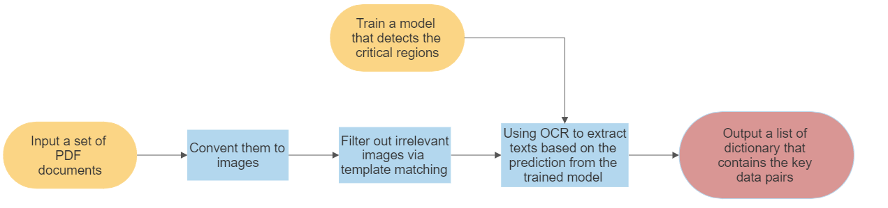
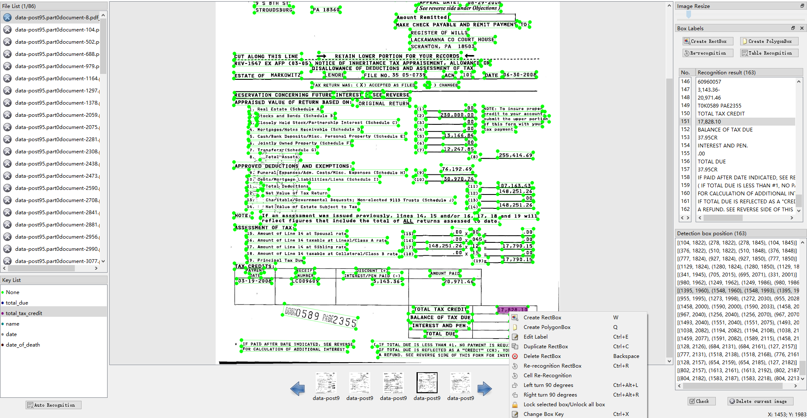
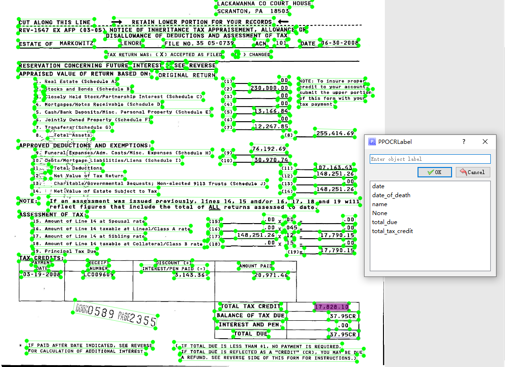

# CS31 - Extracting  data from documents for data science

## Introduction

This project aims to extract valuable information from the old scanned documents. 

## Keywords

- OCR

- Template matching
- Linear regression 

## Installation

- `Python3` environment
- Dependency installation: 
  - `pip3 install -r requirements.txt`
  - `conda install --yes --file requirements.txt`

## Quick Start

- demo program - `python3 main_script.py`

## Methodology



0. Given a set of pdf files as input

1. Convert them to a set of image files (note: a pdf file can have multiple pages), and save them to a temporary directory (e.g. `[root working directory]/tmp/`)

2. Iterate through the temporary directory with the **template matching** script (i.e. filter_util.py). The matched images will be renamed and saved in a directory (default in  `selected/` ).

3. Clear `.../tmp/` and repeat 1-3.

4. Pre-define the position of the critical areas by the labelling tool

   - Please refer to the `Labeling` section for more information.

5. Running the OCR program on each image in the directory specified in `2` that retrieves the text in the certain area (nearest valid block).

6. Save the outputs into a JSON file for further analysis

   1. ```json
      // sample format
      {
          name: "xxx",
          issue_date: "dd-mm-yyyy",
          date_of_death: "dd-mm-yyyy",
          total_tax_payment: 123,
          total_due: 123,
      }
      ```

   2. ```json
      // real output
      {
      'date_of_death': ('03-14-2010', 0.9969242215156555), 'total_tax_payment': ('6.036.00', 0.9693364500999451), 'total_due': ('.00', 0.9907954335212708),
      'name': ('JAMES J ZAYDON JR ESQ', 0.99156653881073), 'estate_of': ('REV-1547 EX AFP (12-09)', 0.9862002730369568)
      }  
      ```

## Finding Critical Areas

In order to predict the position of the critical areas, we use the idea of linear regression to find the area that has the maximum likelihood of being the target area. 

## Labeling

To label the critical areas, we can use `PPOCRLabel`, the labeling software in PaddleOCR that can easily categorize the critical areas with given names.

1. Run  `PPOCRLabel --kie True`
2. Manually label the training set
   1. `PPOCRLabel --kie True`
   2. `Click File -> Open Dir`
   3. The software will automatically recognise the files in the directory
   4. right-click the area you want to label, choose `Change Box Key`
      1. 
   5. Change the label
      1. 
3. Use linear regression to construct a function that represents the maximum likelihood of the position of the critical areas.
4. Match the OCR result with the output of the function to retrieve the position of the critical areas.
5. Extract the text and save it in a python dictionary

Note that the data in `selected/` directory is used as a training set to train the linear regression model.

## Template Matching

We use the template matching technology to detect if a smaller pattern occurs in the target input images. This step can significantly improve the efficiency as template matching is less costly than OCR.

In the `source` directory, we provided a set of logo that can be used to match the files in different time.

- e.g. 2005-2009 ver.: 

#### Reference

- PaddleOCR GitHub Repo: https://github.com/PaddlePaddle/PaddleOCR
- Template matching, OpenCV: https://opencv24-python-tutorials.readthedocs.io/en/latest/py_tutorials/py_imgproc/py_template_matching/py_template_matching.html#template-matching-with-multiple-objects


